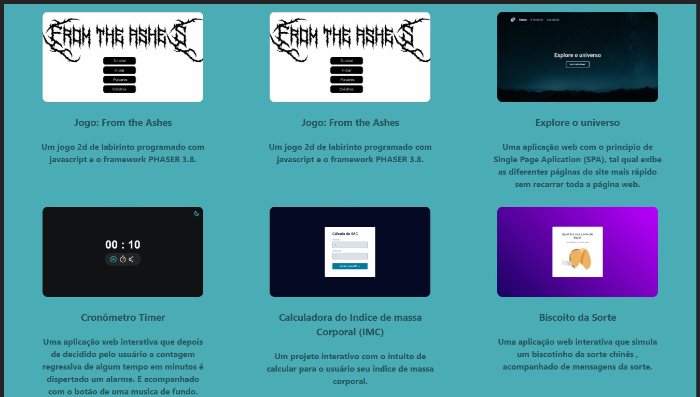
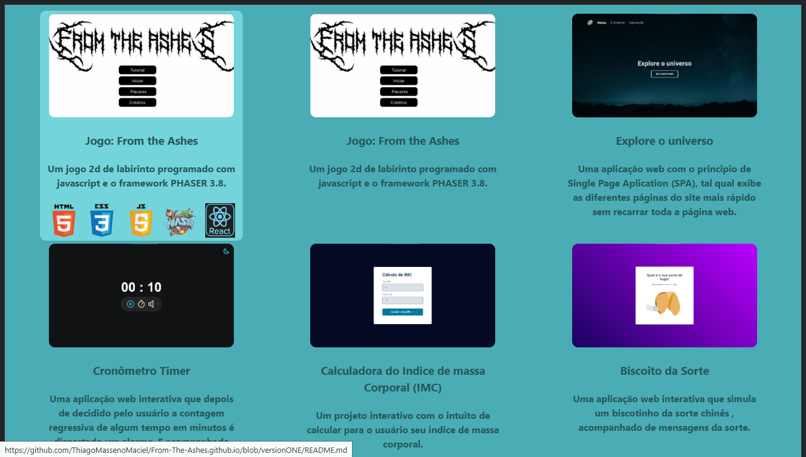
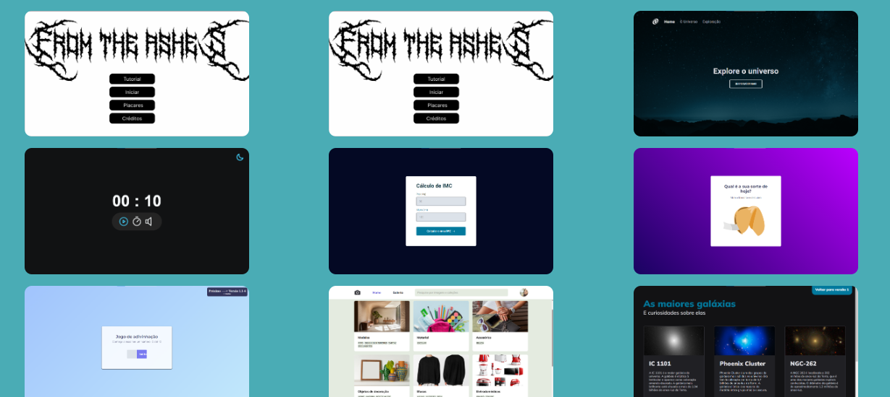
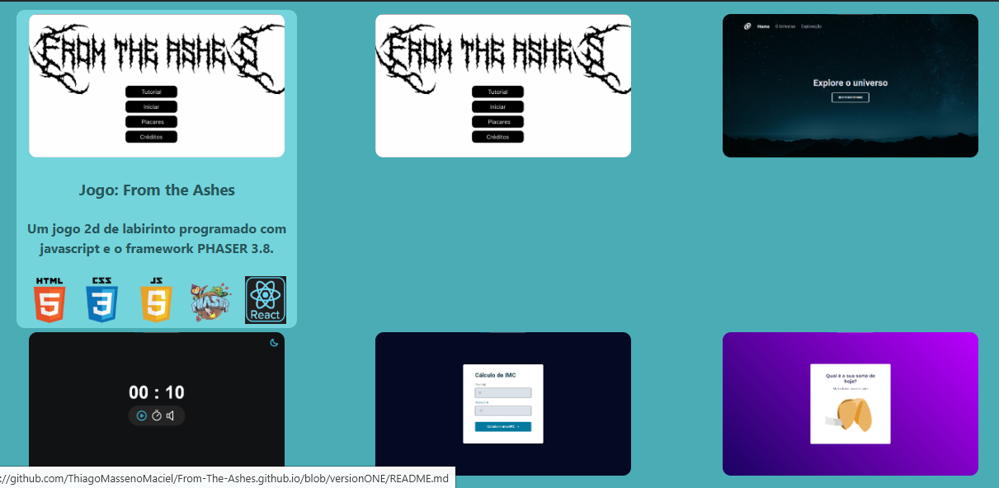
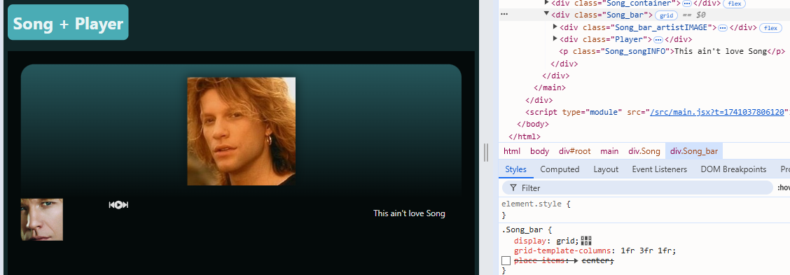
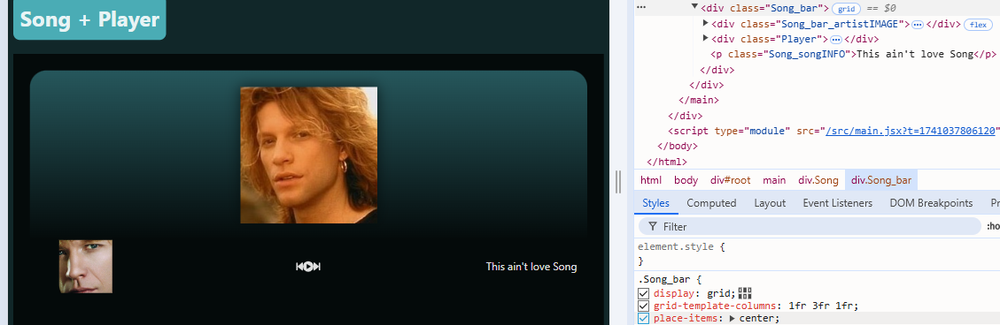
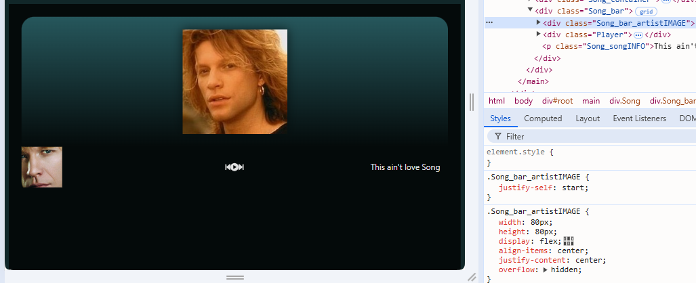
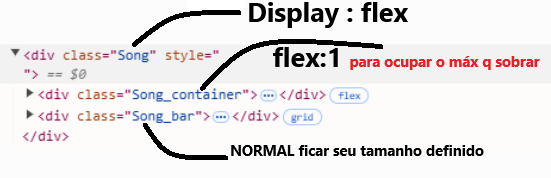
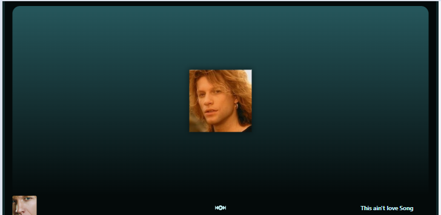

# GRID
```
.Projetos{
  display: grid;
/* grid-template-columns: 340px 340px 340px;  */
/*   grid-template-columns: repeat(3, 340px); */
/*  grid-template-columns: repeat(3, 1fr);    */
/*   grid-template-columns: repeat(3, minmax(340px,1fr));    a width das div filha pode crescer > 340px e n pode diminuir < 340px*/
/*  grid-template-columns: repeat(auto-fit,minmax(340px,1fr));    auto-fit  funciona parecido com o flex-wrap*/ 
  grid-template-columns: repeat(auto-fit, 340px);
  justify-content: space-around;
}
```

# Transition no `:hover`
#### ensinado na jornada fullstack HashTag treinamentos 2025 + o que eu inventei
```
.Projeto_block_TechUsed_img{
  opacity: 0;
  transform: translateY(-100%);
  transition: transform ease 0.3s;
  position: absolute; 
  width: 50px;
}

.Projeto:hover .Projeto_block_TechUsed_img{ 
  opacity: 1;
  transform: translateY(0%);
  position: static;/* serve para crescer o tamanho do componente Projeto de acordo com a quantidade de Techs usada no projeto*/
}
```



#### coloque isso no css e teste
```
.Projeto_block_TechUsed ,
.Projeto_block_text{
  opacity: 0;
  position: absolute;
}

.Projeto:hover .Projeto_block_TechUsed ,
.Projeto:hover .Projeto_block_text{
  opacity: 1;
  position: static;
  transition: opacity ease 0.3s;
}
```
##### sem `:hover`

##### com `:hover`



# IMG 
#### Coloca tag `` dentro de uma div , esta dv quando tiver um display flex a img vai caber dentro da box-sizing definido da div
#### exemplo igual o do projeto Spotify usado no componente `<OutroExemplo/>`
```
.Artistas_Artista{
  position: relative;
}
.Artistas_Artista_Icon{
  font-size: 50px;
  transform: translateX(100%);
  position: absolute;
  color: var(--colorBLUE100);

  right: -10;
  bottom: 0;

  opacity: 0;
  transition: transform ease 0.3s;
  transition-property: transform,opacity;
}
.Artistas_Artista:hover .Artistas_Artista_Icon{
  opacity: 1;
  transform: translateY(-100%);

}
```

###### Colocando uma imagem no background de uma div
```

.ProfileArtist_header{
  padding: 30px;
  height: 450px;
  width: 100%;

  box-sizing: border-box;
  overflow: hidden;
  background-image: linear-gradient(to bottom, var(--colorTRANSPARENT100), var(--colorTRANSPARENT300)), url("https://www.swr3.de/media-assets/1654605065669%2Cits-my-life-bon-jovi-102~_v-16x9@2dL_-6c42aff4e68b43c7868c3240d3ebfa29867457da.jpg");
  background-size: cover;
  background-position: 10%; /* Esta cortando 10% top da imagem no background*/

  display: flex;
  align-items: flex-end;

}
```

###### Colocando os 3 pontinhos no texto grande
```
.ProfileArtist_body_songname_p{
  display: -webkit-box;
  -webkit-line-clamp: 1; 
  line-clamp: 1; 
  -webkit-box-orient: vertical;
  overflow: hidden;
}

.ProfileArtist_body section:hover .ProfileArtist_body_songname_p{
  -webkit-line-clamp: 10; 
  line-clamp: 10; 
}

```
###### sem o place itens 

###### com o place itens

###### diferenciar posição de um dos filhos afetado com o grid
```
.seletor{
  justify-self:start
}
```


###### a tela Song fazer ocupar toda a tela height

```
.Song{
  display: flex;
  flex-direction: column;
}

.Song_container{
  flex: 1;
}
```
###### com o código vai ficar assim a div `.Song_container` ocupa toda o resto da pagina e `.Song` tem conteudo completamente preenchido
