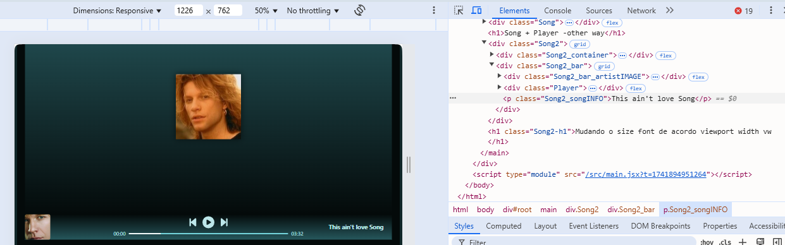

##### Coisas aprendidas no projeto 14 fullstack 
https://github.com/user-attachments/assets/929e556a-3945-4d01-a840-ec84d16c305b

# GRID
```
.Projetos{
  display: grid;
/* grid-template-columns: 340px 340px 340px;  */
/*   grid-template-columns: repeat(3, 340px); */
/*  grid-template-columns: repeat(3, 1fr);    */
/*   grid-template-columns: repeat(3, minmax(340px,1fr));    a width das div filha pode crescer > 340px e n pode diminuir < 340px*/
/*  grid-template-columns: repeat(auto-fit,minmax(340px,1fr));    auto-fit  funciona parecido com o flex-wrap*/ 
  grid-template-columns: repeat(auto-fit, 340px);
  justify-content: space-around;
}
```

# Transition no `:hover`
#### ensinado na jornada fullstack HashTag treinamentos 2025 + o que eu inventei
```
.Projeto_block_TechUsed_img{
  opacity: 0;
  transform: translateY(-100%);
  transition: transform ease 0.3s;
  position: absolute; 
  width: 50px;
}

.Projeto:hover .Projeto_block_TechUsed_img{ 
  opacity: 1;
  transform: translateY(0%);
  position: static;/* serve para crescer o tamanho do componente Projeto de acordo com a quantidade de Techs usada no projeto*/
}
```


#### coloque isso no css e teste
```
.Projeto_block_TechUsed ,
.Projeto_block_text{
  opacity: 0;
  position: absolute;
}

.Projeto:hover .Projeto_block_TechUsed ,
.Projeto:hover .Projeto_block_text{
  opacity: 1;
  position: static;
  transition: opacity ease 0.3s;
}
```
##### sem `:hover`

##### com `:hover`


# IMG 
#### Coloca tag `` dentro de uma div , esta dv quando tiver um display flex a img vai caber dentro da box-sizing definido da div
#### exemplo igual o do projeto Spotify usado no componente `<OutroExemplo/>`
```
.Artistas_Artista{
  position: relative;
}
.Artistas_Artista_Icon{
  font-size: 50px;
  transform: translateX(100%);
  position: absolute;
  color: var(--colorBLUE100);

  right: -10;
  bottom: 0;

  opacity: 0;
  transition: transform ease 0.3s;
  transition-property: transform,opacity;
}
.Artistas_Artista:hover .Artistas_Artista_Icon{
  opacity: 1;
  transform: translateY(-100%);

}
```

###### Colocando uma imagem no background de uma div
```

.ProfileArtist_header{
  padding: 30px;
  height: 450px;
  width: 100%;

  box-sizing: border-box;
  overflow: hidden;
  background-image: linear-gradient(to bottom, var(--colorTRANSPARENT100), var(--colorTRANSPARENT300)), url("https://www.swr3.de/media-assets/1654605065669%2Cits-my-life-bon-jovi-102~_v-16x9@2dL_-6c42aff4e68b43c7868c3240d3ebfa29867457da.jpg");
  background-size: cover;
  background-position: 10%; /* Esta cortando 10% top da imagem no background*/

  display: flex;
  align-items: flex-end;

}
```

###### Colocando os 3 pontinhos no texto grande
```
.ProfileArtist_body_songname_p{
  display: -webkit-box;
  -webkit-line-clamp: 1; 
  line-clamp: 1; 
  -webkit-box-orient: vertical;
  overflow: hidden;
}

.ProfileArtist_body section:hover .ProfileArtist_body_songname_p{
  -webkit-line-clamp: 10; 
  line-clamp: 10; 
}

```
###### sem o place itens 

###### com o place itens

###### diferenciar posição de um dos filhos afetado com o grid
```
.seletor{
  justify-self:start
}
```


###### a tela Song fazer ocupar toda a tela height

```
.Song{
  display: flex;
  flex-direction: column;
}

.Song_container{
  flex: 1;
}
```
###### com o código vai ficar assim a div `.Song_container` ocupa toda o resto da pagina e `.Song` tem conteudo completamente preenchido


###### Song + Player - other way
```
.Song2{
  display: grid;
  grid-template-rows: 1fr auto; /* primeira linha ocupa o max de espace disponivel , auto define o tam do próprio elemento*/
}
```

##### Mudando o size da font de acordo com a largura vw
###### tamanho da fonte / tamanho da width * 100 para conseguir a porcentagem   `(96/1280)*100 = 7.5` logo `7.5%`
###### size da font diminiu enquanto a width for maior que 480px e menor que 1280px 
###### quando a width for menor que 480px a font tera o size fixo
```
.Song2-h1{
  font-size: 96px;
}

@media (max-width:1280px){
  .Song2-h1{
    font-size: 7.5vw;
  }
}
@media (max-width:480px){
  .Song2-h1{
    font-size: 36px;
  }
}
```
# Mudando o layout dos elementos filhos da div `Song2` de acordo com o tamanho da width no `@media(max-width){}`
###### antes de mudar

###### depois de mudar

###### colocar este código naquele elemento filho de um pai com grid

```
@media (max-width: 1080px){
  .Player_time-progress_time{
    display: none;
  }

  .Song2_songINFO{
    grid-column: 2;
    grid-row: 1;
  }
}
```
###### mudando mais para ficar assim


```
@media(max-width: 1280px){
  .Song2 .Player_time-progress_time{ /* Fazer sumir o tempo da musica*/
    display: none;
  }

  .Song2 .Song2_songINFO{ /*Colocar em outro lugar dentro do grid de div pai*/
    grid-column: 2;
    grid-row: 1;
  }

  .Song2 .Song2_bar{
    /*deixando a primeira metade da tela para ocupar o elemento img e elemento nome da musica e deixando a outra metade ocupando o elemento Player*/
    grid-template-columns: auto 1fr 2fr; /*Mudando quantidade de colunas e definito o tamanho de cada uma para um novo layout, primeira coluna do tamanho do elemento ocupando um pedaço , segunda coluna ocupa espaço de um pedaço, e terceiro ocupa o espaço de 2 pedaços*/
  }

  .Song2 .Song2_songINFO{ /*Colocar em outro lugar dentro do grid de div pai*/
    justify-self: start; /* Para ficar mais próximo do elemento imagem */
  }
}

@media (max-width: 800px){
  .Song2 .Player_time-progress_time{ /* Fazer sumir o tempo da musica*/
    display: none;
  }

  .Song2 .Song2_songINFO{ /*Colocar em outro lugar dentro do grid de div pai*/
    grid-column: 2;
    grid-row: 1;
  }
  .Song2 .Player{
    grid-row: 2;
    grid-column: 1 / span 2; /*começa na coluna 1 e se expande até a coluna 2*/
  }

  .Song2 .Song2_bar{
    grid-template-columns: auto 1fr; /*Mudando quantidade de colunas e definito o tamanho de cada uma para um novo layout, primeira coluna do tamanho do elemento, segunda coluna ocupa o máximo que puder*/
  }

  .Song2 .Song2_songINFO{ /*Colocar em outro lugar dentro do grid de div pai*/
    justify-self: start; /* Para ficar mais próximo do elemento imagem */
  }
}
```
###### resultado do último código width > 1280px 

###### resultado do último código width < 1280px 

###### resultado do último código width < 800px 


